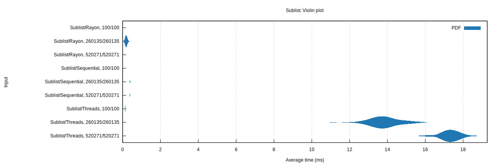

# Sublist

Based on [Sublist on Exercism's Rust Track](https://exercism.org/tracks/rust/exercises/sublist) but 
with an additional challenge - exploxing Rust multithreading capabilities for CPU bound tasks.

## Performance Test

